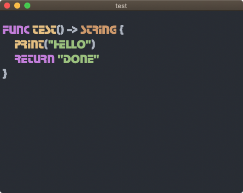
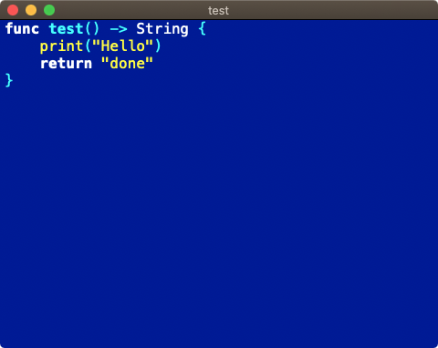

# HighlighterSwift 2.0.0

This library provides a Swift wrapper for the popular [Highlight.js](https://highlightjs.org/) code highlighting utility.



It is a more up-to-date version of Juan Pablo Illanes’ [Highlightr](https://github.com/raspu/Highlightr) and relies heavily upon code from that project, which is unfortunately now no longer fully maintained.

### Improvements and Changes

Highlightr makes use of Highlight.js 9.13.4, but the most recent release of the JavaScript in June 2021 was version 11.0.1. The use of version 9 is no longer supported or recommended by the Hightlight.js team. Version 1.x of HighlighterSwift made use of Highlight.js 10.7.3. Version 2.0.0 moves to Highlight.js 11.5.0.

HighlighterSwift adds support for alpha values in CSS colours, eg. `#808080AA`, not present in Highlightr.

Unlike Highlightr, HighlighterSwift parses Highlight.js themes for separate declarations of the same style. For example, Hybrid contains the following CSS:

```css
.hljs{display:block;overflow-x:auto;padding:.5em;background:#1d1f21}.hljs span::selection,.hljs::selection{background:#373b41}.hljs{color:#c5c8c6}
```

The `hljs.color` attributed is added to `hljs.display`,  `hljs.overflow-x`, `hljs.padding` and `hljs.background`, it doesn’t replace them.

HighlighterSwift was designed from the ground up as a Swift Package. Support for legacy package managers is not included. Highlightr supprts CocoaPods and Carthage.

HighlighterSwift is more deeply commented and the code is presented in a more consistent style.

A number of functions have been given extra parameters, primarily to add font selection when setting themes and initiating Theme objects. Redundant code has been removed. Some parameters have been renamed.

Unit tests have been added, and more will come, I hope.



#### Why not update Highlightr?

HighlighterSwift was created to meet the needs of a specific project, which was originally conceived with a modified version Hightlightr in mind. Some of the changes listed above are breaking, and so I feel it’s not appropriate to just inflict them on the Hightlightr source, especially when there are many outstanding pull requests.But I’m not opposed to pulling in my changes if the community requests that.

HighlighterSwift is released under the same [licence](#licence) as Highlightr, allowing developers to select either, both or a mix of the two.

## Platform Support

HighlighterSwift supports macOS 10.14 and up, and iOS 12 and up. iOS support is untested, however.

## Installation

To add HighlighterSwift to your project, use Xcode to add it as a Swift Package at this repo’s URL. The library contains the Highlight.js code and themes.

**Note** This project was begun to support another, so some themes have been modified slightly to meet the needs of that other project. For example, background images have been removed from the Brown Paper, Greyscale, Schoolbook and Pojoacque themes; the two Kimbies have been renamed for consistency; colours have been formalised as hex values.

## Usage

Instantiate a *Highlighter* object. Its *init()* function returns an optional, which will be `nil` if the `Highlight.min.js` could not be found or is non-functional, or the `Default` theme CSS file is missing:

```swift
if let highlighter: Highlighter = Highlighter.init() {
    ...
}
```

You can set a specific theme using the *setTheme()* function:

```swift
highlighter.setTheme("atom-one-light")
```

You can apply your chosen font — the default is 14pt Courier — at this time too:

```swift
highlighter.setTheme("atom-one-light", withFont: "Menlo-Regular", ofSize: 16.0)
```

You can set or change your preferred font later by using *setCodeFont()*, which takes an NSFont or UIFont instance configured for the font and text size you want and is called on the Highlighter instance’s *theme* property:

```swift
let font: NSFont = NSFont.init(name: "Menlo-Regular", size: 12.0)!
highlighter.theme.setCodeFont(font)
```

Finally, get an optional NSAttributedString containing the formatted code using the instance’s *highlight()* method:

```swift
if let displayString: NSAttributedString = highlighter.highlight(codeString, as: "swift") {
    myTextView.textStorage!.addAttributedString(displayString)
}
```


The second parameter is the name of language you’re rendering. If you leave out this parameter, or pass `nil`, Highlighter will use Highlight.js’ language detection feature.

You can get a list of supported languages by the name they are known to Highlight.js by calling *supportedLanguages()* — it returns an array of strings.

The function *availableThemes()* returns a list of the installed themes.

## Release Notes

* 2.0.0 *Unreleased*
    - Update to Highlight.js 11.5.0.
    - Include all Highlight.js languages.
* 1.0.1 *23 July 2021*
    - Correct list of available themes in `package.swift`.
* 1.0.0 *15 July 2021*
    * Initial public release.

## Licences

HighlighterSwift, like Highlightr before it, is released under the terms of the MIT Licence. Hightlight.js is released under the BSD 3-Clause Licence.

HighlighterSwift is &copy; 2022, Tony Smith. Portions are &copy; 2016, Juan Pablo Illanes. Other portions are &copy; 2006-2022, Ivan Sagalaev.
